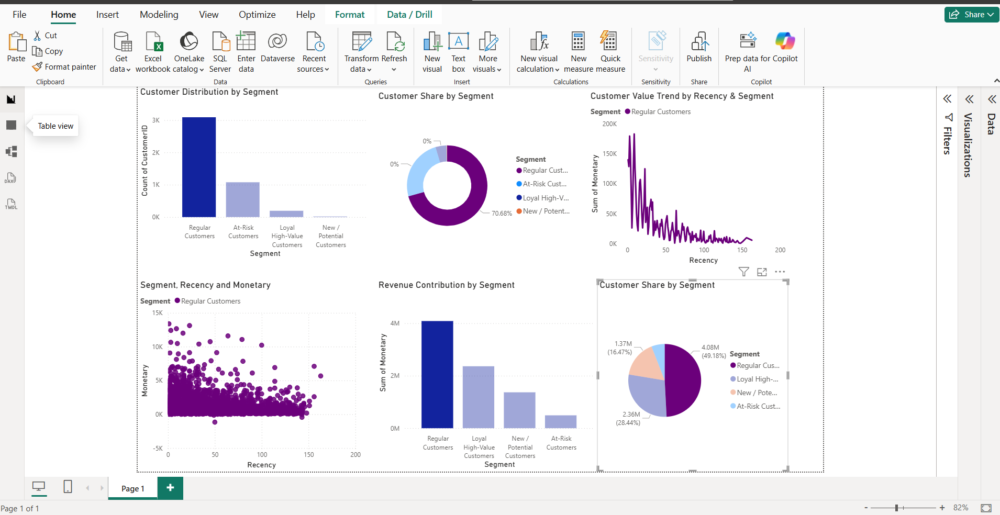

# 📊 Customer Segmentation using RFM Analysis (Python & Power BI)

## 🔎 Problem Statement
Businesses often struggle to understand which customers are most valuable, which are at risk of churn, and where to focus retention efforts. Raw transactional data alone does not provide actionable insights unless it is structured and analyzed effectively.

This project addresses that problem by applying **RFM (Recency, Frequency, Monetary) analysis** to segment customers based on their purchasing behavior and presenting the insights through a clean, interactive Power BI dashboard.

---

## 🎯 Project Objective
The objective of this project is to:
- Analyze customer purchase behavior using transactional retail data
- Segment customers into meaningful and actionable groups
- Identify high-value, loyal, and at-risk customers
- Build a professional dashboard to support data-driven business decisions

---

## 🧠 Approach & Methodology
The project follows an end-to-end analytics workflow:

1. **Data Cleaning & Preparation**
   - Removed missing and invalid customer records
   - Converted date fields to proper datetime format
   - Created total transaction value from quantity and unit price

2. **Feature Engineering (RFM Analysis)**
   - **Recency**: Days since the customer’s most recent purchase
   - **Frequency**: Number of transactions made by the customer
   - **Monetary**: Total spending by the customer

3. **Customer Segmentation**
   - Customers were classified into segments such as:
     - Loyal High-Value Customers
     - Regular Customers
     - New / Potential Customers
     - At-Risk Customers

4. **Data Visualization (Power BI)**
   - Built an interactive dashboard with KPIs, bar charts, pie charts, line charts, and scatter plots
   - Focused on clarity, consistency, and business storytelling

---

## 📊 Dashboard Insights
The Power BI dashboard provides insights such as:
- Distribution of customers across different segments
- Revenue contribution by each customer segment
- Identification of high-value and churn-risk customers
- Relationship between recency, frequency, and monetary value
- Actionable insights for customer retention and targeting strategies

---

## 🛠 Tools & Technologies Used
- **Python** (Pandas, NumPy)
- **Jupyter Notebook**
- **RFM Analysis**
- **Power BI**
- **CSV Dataset**
- **GitHub** (Version Control & Project Hosting)

---

## 📁 Project Structure

---

## 🚀 How to Use This Project
1. Clone or download this repository
2. Open the Jupyter Notebook to review data cleaning and RFM analysis
3. Open the `.pbix` file using Power BI Desktop
4. Explore the interactive dashboard and customer insights

---

## 📌 Key Learnings
- Practical implementation of RFM-based customer segmentation
- Translating raw transactional data into business insights
- Designing professional, executive-ready dashboards
- Applying data analytics to real-world business problems

---

## 🔗 Project Status
✅ Completed  
📌 Open for future enhancements such as predictive modeling and automation

---## 📸 Dashboard Preview

### Executive Overview

## 🔍 Key Business Insights

- Majority of customers belong to the **Regular Customers** segment, contributing the highest share of revenue.
- **Loyal High-Value Customers**, though fewer in number, generate significantly higher monetary value per customer.
- **At-Risk Customers** show high recency values with low monetary contribution, indicating churn risk.
- Recent customers with high spending present strong **upsell and retention opportunities**.

## 🛠 Tools & Technologies

- Python (Pandas, NumPy) – Data cleaning & RFM analysis  
- Jupyter Notebook – Exploratory Data Analysis  
- Power BI – Interactive dashboard & visual analytics  
- Git & GitHub – Version control and project documentation  

## 👤 Author
**Nikhita Sargam**  
Aspiring Data Analyst | Python | Power BI | Data Visualization

